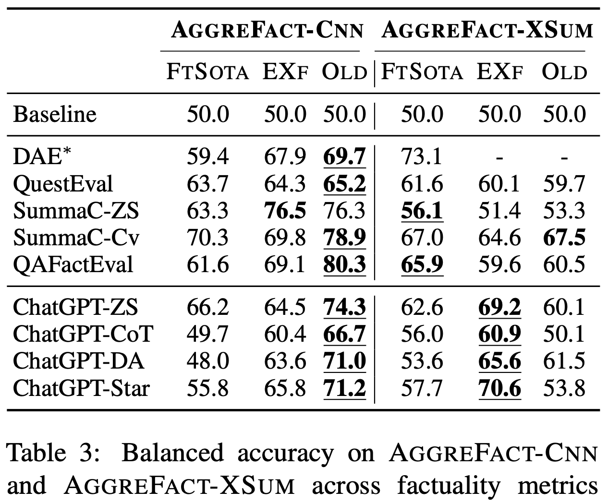
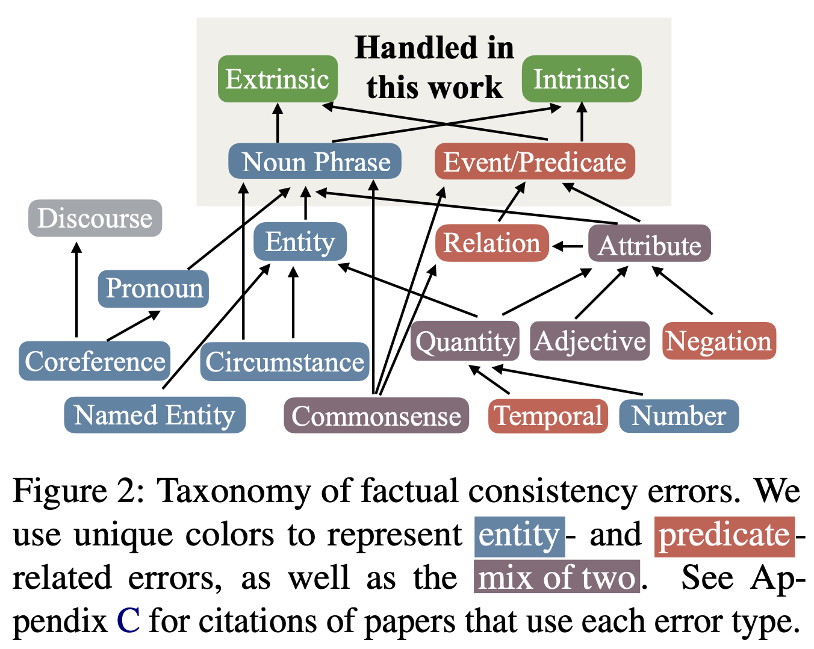

# Understanding Factual Errors in Summarization: Errors, Summarizers, Datasets, Error Detectors

## Announcement

Our paper is accepted to ACL 2023! Please consider citing our paper if you find it useful.

## TL;DR

Reported results on standard summarization factuality benchmarks can be misleading. Factuality metrics, even ChatGPT-based, don’t actually improve on more recent summarizers!

## Abstract

The propensity of abstractive summarization models to make factual errors has been studied extensively, including design of metrics to detect factual errors and annotation of errors in current systems’ outputs. However, the ever-evolving nature of summarization systems, metrics, and annotated benchmarks makes factuality evaluation a moving target, and drawing clear comparisons among metrics has become increasingly difficult. In this work, we aggregate factuality error annotations from nine existing datasets and stratify them according to the underlying summarization model. We compare performance of state-of-the-art factuality metrics, including recent ChatGPT-based metrics, on this stratified benchmark and show that their performance varies significantly across different types of summarization models. Critically, our analysis shows that much of the recent improvement in the factuality detection space has been on summaries from older (pre-Transformer) models instead of more relevant recent summarization models. We further perform a finer-grained analysis per error-type and find similar performance variance across error types for different factuality metrics. Our results show that no one metric is superior in all settings or for all error types, and we provide recommendations for best practices given these insights.

Please check our latest paper version [here](https://arxiv.org/pdf/2205.12854.pdf).

## AggreFact Benchmark

The dataset can be found in the `data` folder. `aggre_fact_sota.csv` is a subset of `aggre_fact_final.csv`, which only contains summaries generated by SOTA models. The followings are descriptions of column names.

|Col. name | Description |
|--|--|
|dataset|Name of the original annotated dataset.|
|origin | Summarization dataset. Either *cnndm* or *xsum*. |
|id| Document id.|
|doc| Input article. |
|summary| model generated summary.|
|model_name| Name of the model used to generate the summary|
|label|Factual consistency of the generated summary. 1 is factually consistent, *0* otherwise.|
|cut| Either *val* or *test*.|
|*system*_score| The output score from a *factuality system*.|
|*system*_label| The binary factual consistency label based on the score of the factuality system. Only examples in the *test* set have labels. Labels are determined under the *threshold-per-dataset* setting.

The new csv file containing the results from chatgpt based metrics will be released shortly.

## Main Result

## Unified Error Types

We unified unique error type taxonomies from XSumFaith, FRANK, Goyal21 and CLIFF under `data/error_type_mapping`. More details can be found in Section 4 of the paper.

